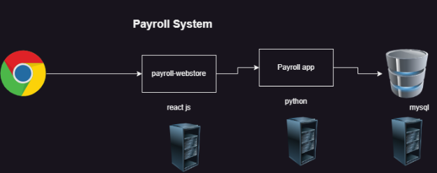

## Terraform: 25/Jul/2023,
### Story of LT
*Basic architecture
* 
* LT has 3 customers who are ready to buy
     * TCS wants to run application on AWS
     * Infosys on Azure
     * JP Morgan on vmware
* How to automate these different deployments
     * Creating manually
     * For automation:
         * AWS has Cloud formation
         * Azure has ARM Templates
     * Terraform can automate infra creation in almost all the virtual environments and Terraform is an open source software and provides enterprise.
     * Terraform also allows us to deal with multiple environments
