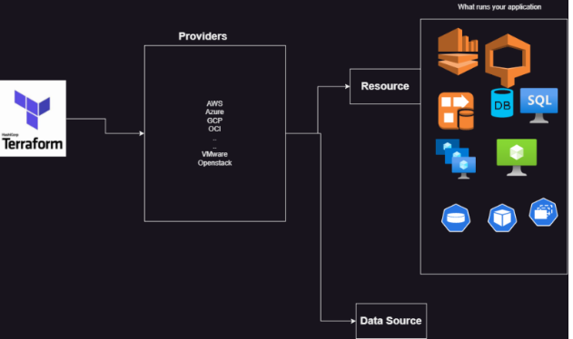
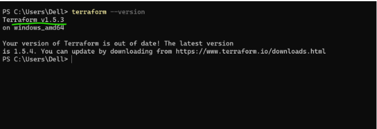
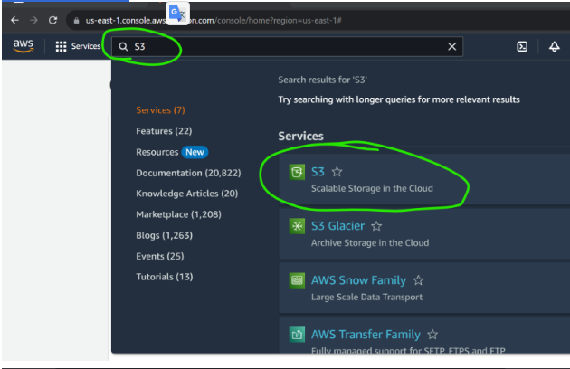
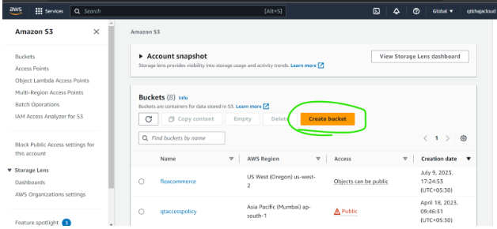
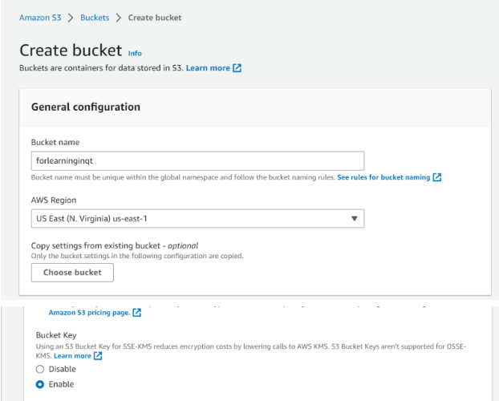
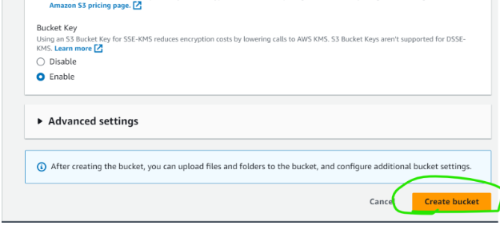
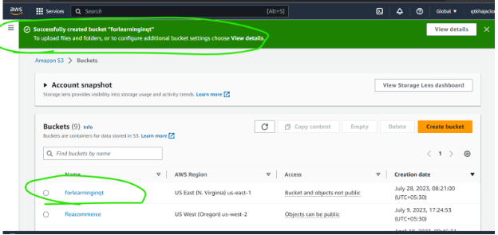
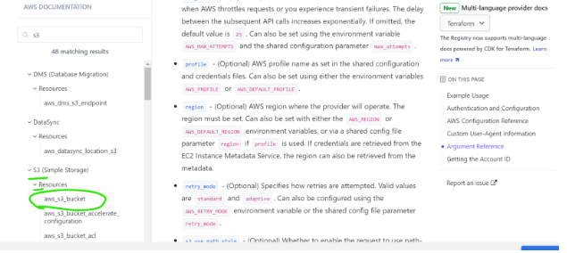
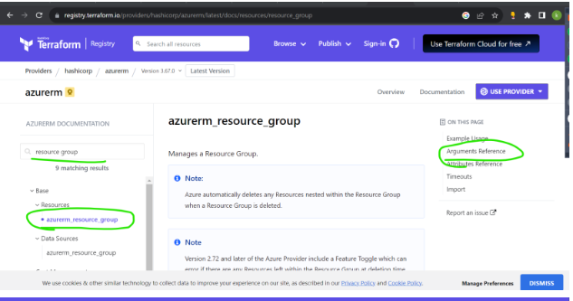
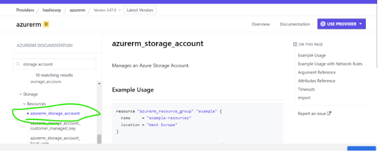

## Terraform: 25/Jul/2023,
### Story of LT
* Basic architecture
* 
* LT has 3 customers who are ready to buy
     * TCS wants to run application on AWS
     * Infosys on Azure
     * JP Morgan on vmware
* How to automate these different deployments
     * Creating manually
     * For automation:
         * AWS has Cloud formation
         * Azure has ARM Templates
     * Terraform can automate infra creation in almost all the virtual environments and Terraform is an open source software and provides enterprise.
     * Terraform also allows us to deal with multiple environments
## 2nd Class 26/Jul/2023,
### What Is Terraform? 
Terraform is an IAC tool, used primarily by DevOps teams to automate various infrastructure tasks. The provisioning of cloud resources, for instance, is one of the main use cases of Terraform. It’s a cloud-agnostic, open-source provisioning tool written in the Go language and created by HashiCorp.
## Architecture of Terraform:
* Terraform is developed in Go language and installation of terraform is one executable
* Providers are not part of terraform installations as we try to create infra, as part of initializations providers are downloaded
* Providers have resources and datasources as part of it

### Concepts of Terraform:
* Provider: This determines the target area to create infra structure
     * [Refer Here](https://registry.terraform.io/browse/providers) for the list of provider
#### Terraform provider means:     
* A provider in Terraform is a plugin that enables interaction with an API. This includes Cloud providers and Software-as-a-service providers. The providers are specified in the Terraform configuration code. They tell Terraform which services it needs to interact with
* Terraform providers are of three categories
     * official
     * partner
     * community
* [Refer Here](https://developer.hashicorp.com/terraform/language/providers) for providers documenation by hashicorp
* Note: For you reference we have used the following template
##### Terraform AWS Provider:

```
terraform {
  required_providers {
    aws = {
      source = "hashicorp/aws"
      version = "2.33.0"
    }
    azurerm = {
      source  = "hashicorp/azurerm"
      version = "=3.0.0"
    }
  }
}

provider "azurerm" {
    features {

    }
}

provider "aws" {
    region = "us-west-2"
}

resource "aws_instance" "fromtf" {
    ami = "ami-03f65b8614a860c29"
    tags = {
      Name ="from terraform"
    }
    key_name = "my_id_rsa"
    vpc_security_group_ids = ["sg-05adaf452b268c335"]
    instance_type = "t2.micro"

}


resource "azurerm_resource_group" "test" {
    name = "test"
    location = "eastus"

}
```
* Arguments and Attributes:
    * Argument refers to inputs in terraform
    * Attributes refers to outputs in terraform

#### 3rd class 27/Jul/2023,
## Infrastructure as a Code (IaC)  
* This allows us to declare the infrastructure i.e. we would represent our needs in some format and the tool does the rest of creation/deletion/updating the resources.
* We deal with declarative language and desired state.  
### Infra Provisioning
* This is about a tool which lets you express your infrastructure as a code and manages multiple environments and reusability
### Terraform
* This is infra provisioning tool and supports infrastructure as code, terraform uses Hashicorp configuration language HCL
#### Ways of Working with Terraform (First version)
* Create the infrastructure manually atleast once as this helps
     * in figuring out inputs to be passed.
     * order of creation
     * every resource to be part of architecture
* Figure out the right provider and resources
### Syntaxes in Terraform
* Provider: Refer Here for official docs
   * syntax
provider '<name-of-provider>' {
arg-name-1 = arg-value-1
..
arg-name-n = arg-value-n
}
   * Example
provider "aws" {
region = "us-west-2"
}
* Generally we need to configure credentials for providers as well.
* resource: This represents the infrastructural element to be created Refer Here
* syntax
resource "<resource_type>" "name" {
arg-name-1 = arg-value-1
..
arg-name-n = arg-value-n
}
* Example
“`
resource "aws_instance" "fromtf" {
ami = "ami-03f65b8614a860c29"
tags = {
Name ="from terraform"
}
key_name = "my_id_rsa"
vpc_security_group_ids = ["sg-05adaf452b268c335"]
instance_type = "t2.micro"</li>
</ul>
}


##### Installing terraform [Refer Here](https://developer.hashicorp.com/terraform/tutorials/aws-get-started/install-cli)
* Commands   
```
choco install vscode terraform -y
```

#### Note:
* Windows: [Refer Here](https://www.youtube.com/watch?v=9guzVbZPGuw&list=PLuVH8Jaq3mLud3sVDvJ-gJ__0zd15wGDd&index=17)for installing necessary softwares
git
* windows terminal for windows 10 [Refer Here](https://www.youtube.com/watch?v=qLVn2EvPsYc&list=PLuVH8Jaq3mLud3sVDvJ-gJ__0zd15wGDd&index=12)
#### Mac:
* Homebrew [Refer Here](https://brew.sh/)
* git `brew install git`
* visual studio code `brew install --cask visual-studio-code`
* terraform `brew install terraform`
* azure cli `brew install azure-cli`
### 4th class 28/Jul/2023,
#### Activity-2: Create a s3 bucket
* Navigate to s3





* Resource:
   * s3 bucket
* inputs:
   * region
   * bucket name
#### Infra Provisioning using terraform.
* Create an empty folder
* [Refer Here](https://registry.terraform.io/providers/hashicorp/aws/latest/docs) to provider docs
* [Refer Here](https://directdevops.blog/2023/07/27/aws-classroomnotes-27-jul-2023/) for basic user creation steps and [Refer Here](https://sst.dev/chapters/create-an-iam-user.html)
* Lets find the resource  
 
* [Refer Here](https://registry.terraform.io/providers/hashicorp/aws/latest/docs/resources/s3_bucket) for s3 resource
* Now look at argument reference [Refer Here](https://registry.terraform.io/providers/hashicorp/aws/latest/docs/resources/s3_bucket#argument-reference) of resource
* Handling credenitals in AWS
    * install aws cli
    * aws configure
* [Refer Here](https://github.com/asquarezone/TerraformZone/commit/a3c6f608f6e22b0c461f958b440856946f825052) for sample activity
#### Activity 3: Create a storge account in Azure
* Refer Here for the official docs on how to create storage account
* Resources:
     * Resource Group
         * inputs:
           * name
           * location
     * storage account
         * inputs:
         * resource group name
         * location
         * name of storage account
* [Refer Here](https://registry.terraform.io/providers/hashicorp/azurerm/latest/docs) for terraform provider
* [Refer Here](https://learn.microsoft.com/en-us/cli/azure/install-azure-cli) to install azure cli `az login`
* [Refer Here](https://registry.terraform.io/providers/hashicorp/azurerm/latest/docs/resources/resource_group) for resource group docs and [Refer Here](https://registry.terraform.io/providers/hashicorp/azurerm/latest/docs/resources/storage_accou) for resource group docs   
      

* [Refer Here](https://github.com/asquarezone/TerraformZone/commit/3c82fe735bee3e9d83579ba377d3f447f0605329) for the changes

